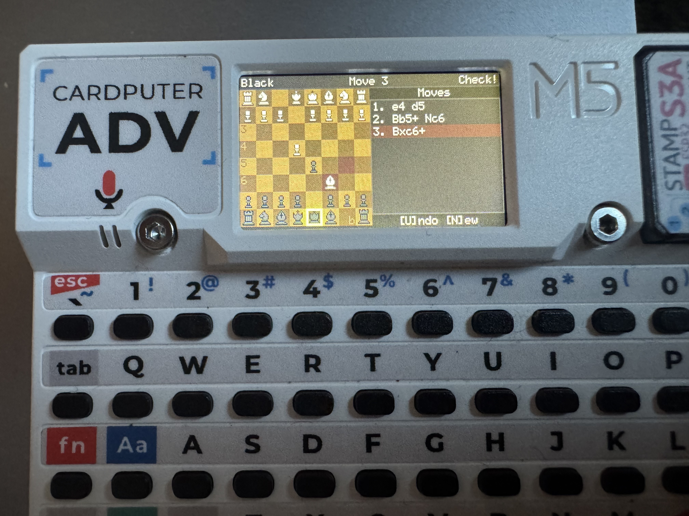

# Cardputer ADV Chess

A chess game for the M5Stack Cardputer Advance featuring local pass-and-play, AI opponent, wireless multiplayer via ESP-NOW, Chess960, timed games, and puzzles. Built with the [CardGFX](lib/cardgfx/README.md) UI framework.



## Features

- Full chess rules: castling, en passant, pawn promotion, check/checkmate/stalemate detection
- 50-move rule and insufficient material draw detection
- **Chess960** (Fischer Random) variant with all 960 starting positions
- **Time controls**: Bullet (1+0), Blitz (3+2, 5+3), Rapid (10+0), or untimed
- Five game modes: local pass-and-play, vs AI, wireless multiplayer (host/join), and puzzles
- AI opponent with three difficulty levels and an opening book
- Wireless multiplayer over ESP-NOW (no WiFi network required)
- **Puzzle mode** with mate-in-1, mate-in-2, and tactical puzzles with progress tracking
- **Pixel art sprites** with toggle to classic letter rendering (press **T**)
- **Black & white board** toggle for high-contrast play (press **B**)
- Animated piece movement between turns
- **Move review mode** — step through the game's move history
- Move history panel with standard algebraic notation (SAN)
- Persistent game saving — games auto-save after each move and survive power cycles
- Undo support (local and AI modes)
- Resign support (online mode)
- Status bar showing current turn, move number, check/game-over indicators, and clock

## Game Modes

On launch, a lobby screen presents the available options. If a saved game exists, a **Resume** button appears at the top of the menu.

| Mode | Description |
|------|-------------|
| **Resume** | Continue a previously saved game (only shown when a save exists). |
| **Local** | Pass-and-play on a single device. The board auto-rotates after each move so the current player's pieces are always at the bottom. |
| **vs AI** | Play against the computer. Choose variant, time control, difficulty (Easy/Medium/Hard), and your color (White/Black). |
| **Host** | Broadcast a game over ESP-NOW and wait for an opponent to join. Choose variant and time control before hosting. Host plays White. |
| **Join** | Scan for nearby hosts. A list shows discovered hosts with their variant and time control. Select a host to connect. Joiner plays Black. |
| **Puzzles** | Solve chess puzzles organized by category (mate-in-1, mate-in-2, tactics). Progress is saved across sessions. |

Starting a new game (Local, vs AI, Host, or Join) clears any existing save. Network games are not saved since the connection cannot survive a power cycle.

### Lobby Flow

When starting a Local, vs AI, or Host game, the lobby walks through a setup flow:

1. **Variant** — Standard or Chess960
2. **Time Control** — No Timer, 1+0, 3+2, 5+3, or 10+0
3. **Mode-specific** — AI games continue to difficulty and color selection

Each step has a **Back** button to return to the previous choice.

When joining, the joiner skips setup entirely — the host's variant and time control are shown in the host list and applied automatically on connect.

## Chess960

Chess960 (Fischer Random Chess) randomizes the back-rank piece placement while preserving castling compatibility. All 960 legal starting positions are supported. When selected, a random position is generated for each game.

Castling in Chess960 follows the standard "king ends on c1/g1" convention regardless of the rook's starting position.

## Time Controls

| Preset | Initial Time | Increment |
|--------|-------------|-----------|
| **1+0** (Bullet) | 1 minute | None |
| **3+2** (Blitz) | 3 minutes | +2 seconds per move |
| **5+3** (Blitz) | 5 minutes | +3 seconds per move |
| **10+0** (Rapid) | 10 minutes | None |

Clocks are displayed in the status bar. When a player's time runs out, they lose on time. Timer state is included in saved games.

## AI Opponent

| Difficulty | Search Depth | Time Limit | Notes |
|------------|-------------|------------|-------|
| **Easy** | 2 | 200ms | 30% chance to pick a random legal move |
| **Medium** | 4 | 1s | Standard play |
| **Hard** | 6+ | 3s | Iterative deepening for maximum depth within time |

The AI uses alpha-beta pruning with move ordering (captures scored by MVV-LVA, promotions prioritized) and quiescence search to avoid the horizon effect. Positional evaluation uses piece-square tables. An opening book provides variety in standard games.

## Puzzle Mode

Puzzles are organized into three categories:

- **Mate in 1** — Find the checkmate in one move
- **Mate in 2** — Find the forcing sequence (you make 2 moves, opponent responds between)
- **Tactics** — Find the best move or combination

The puzzle menu shows overall progress (solved/total) and per-category counts. A **Next** button jumps to the first unsolved puzzle.

In multi-move puzzles (mate-in-2, tactics), the opponent's response is auto-played after a short delay. If you play the wrong move, the board resets to try again.

### Puzzle Controls

| Key | Action |
|-----|--------|
| **H** | Hint — first press highlights the source square, second press adds the destination |
| **S** | Skip to next puzzle |
| **Esc** | Deselect piece (if selected) or exit to lobby |

## Wireless Multiplayer

ESP-NOW is a connectionless WiFi peer-to-peer protocol — no router or network setup needed. Both devices just need to be within WiFi range (~30m indoors). Pairing times out after 60 seconds.

The host broadcasts a discovery message every 500ms. Joiners see a list of available hosts with their variant and time control settings. When a joiner selects a host, both devices exchange handshake messages and the game begins. Moves are sent with sequence numbers and acknowledged to ensure reliable delivery.

## Controls

### In Game

| Key | Action |
|-----|--------|
| **;** or **FN + ;** | Move cursor up |
| **.** or **FN + .** | Move cursor down |
| **,** or **FN + ,** | Move cursor left |
| **/** or **FN + /** | Move cursor right |
| **Enter** or **Space** | Select piece / confirm move |
| **Esc** (side button) | Deselect piece / cancel |
| **U** | Undo last move (local/AI only) |
| **N** | Return to lobby with confirmation (local/AI only) |
| **R** | Resign with confirmation (online only) |
| **V** | Enter move review mode |
| **T** | Toggle between pixel art sprites and letter pieces |
| **B** | Toggle black & white board colors |

> The Cardputer has no hardware arrow keys. The `;` `,` `.` `/` keys are mapped to arrows at the framework level, so they work as directional controls in all scenes.

### In Review Mode

Step through the game's move history to analyze past positions.

| Key | Action |
|-----|--------|
| **,** | Step backward one move |
| **.** | Step forward one move |
| **Esc** | Exit review mode |

Review mode is accessible during play (press **V**) or from the game-over dialog via the **Review** button.

### In Lobby

| Key | Action |
|-----|--------|
| **,** **/** | Navigate menu buttons |
| **Enter** | Select |
| **Esc** | Go back / cancel hosting/joining |

### Promotion

When a pawn reaches the back rank, a dialog appears with four choices: Queen, Knight, Rook, Bishop. Use **,** **/** to navigate, **Enter** to confirm.

### Game Over

When checkmate, stalemate, 50-move rule, insufficient material, or time-out is detected, a dialog offers:

- **Menu** / **Lobby** — return to the lobby
- **Review** — enter review mode to step through the game

## Installation

### M5 Burner (easiest)

1. Open [M5Burner](https://docs.m5stack.com/en/download) and filter by **Cardputer**
2. Find **Cardputer ADV Chess** and click **Burn**

### Build from Source

**Prerequisites:** [PlatformIO](https://platformio.org/) (CLI or VSCode extension) and an M5Stack Cardputer Advance.

```bash
# Build
pio run

# Upload to device
pio run --target upload

# Open serial monitor (115200 baud)
pio device monitor
```

The build automatically generates a merged M5Burner-compatible binary at `firmware/cardputer-chess-<version>.bin`.

## Project Structure

```
.
├── src/
│   ├── main.cpp                # Entry point
│   ├── lobby_scene.h/.cpp      # Pre-game lobby (mode/variant/time select, ESP-NOW pairing)
│   ├── chess_scene.h/.cpp      # Game UI (board, widgets, input, animation, puzzles)
│   ├── chess_types.h           # Piece, Square, Move data types
│   ├── chess_board.h/.cpp      # Board state, make/unmake move
│   ├── chess_rules.h/.cpp      # Move generation, check detection
│   ├── chess_ai.h/.cpp         # AI opponent (alpha-beta with iterative deepening)
│   ├── chess_opening_book.h/.cpp # Opening book for AI variety
│   ├── chess960.h              # Chess960 position generation
│   ├── chess_storage.h/.cpp    # Persistent game save/load (ESP32 NVS)
│   ├── chess_net_protocol.h    # Network message types and protocol
│   ├── esp_now_transport.h/.cpp  # ESP-NOW send/receive layer
│   ├── puzzle_data.h/.cpp      # Embedded puzzle database
│   ├── puzzle_storage.h/.cpp   # Puzzle progress persistence
│   └── chess_sprites.h         # Auto-generated RGB565 piece sprites (from convert_sprites.py)
├── lib/
│   └── cardgfx/                # CardGFX UI framework (see its README)
├── firmware/                   # M5Burner merged binaries (build artifact)
├── pixel_chess_16x16_icons/     # Source PNG sprite sheets
├── convert_sprites.py          # Pre-build script: PNG → RGB565 C header
├── post_build.py               # Post-build script (M5Burner binary, release staging)
├── inject_version.py           # Build script to inject firmware version
├── platformio.ini              # Build configuration
└── README.md
```

## Dependencies

| Library | Version | Purpose |
|---------|---------|---------|
| [M5Unified](https://github.com/m5stack/M5Unified) | ^0.2.10 | Unified hardware abstraction |
| [M5Cardputer](https://github.com/m5stack/M5Cardputer) | ^1.1.1 | Cardputer keyboard and hardware |
| [M5GFX](https://github.com/m5stack/M5GFX) | ^0.2.16 | Graphics library |

## License

MIT
