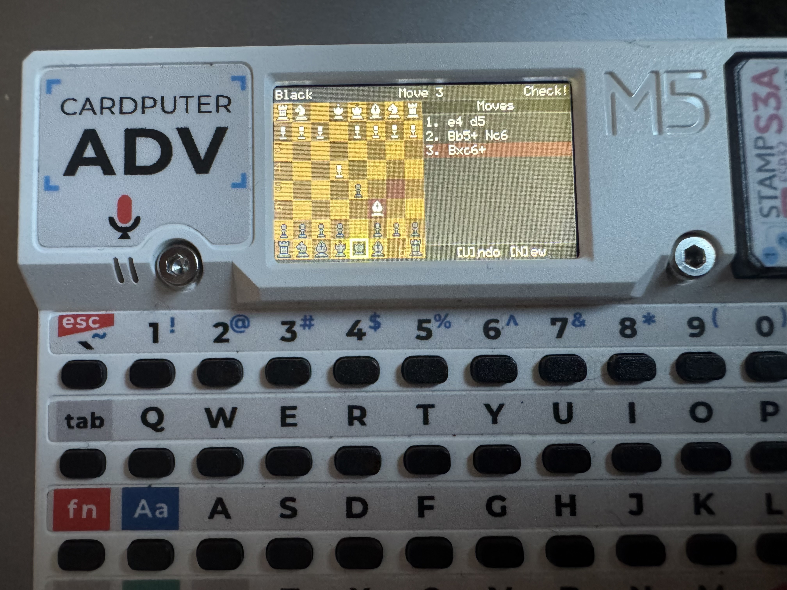

# Cardputer ADV Chess

A chess game for the M5Stack Cardputer Advance featuring local pass-and-play, AI opponent, wireless multiplayer via ESP-NOW, Chess960, timed games, and puzzles. Built with the [CardGFX](lib/cardgfx/README.md) UI framework.



## Development Status

The v0.20.0 release implements the first post-testing improvement pass: conventional chess-clock behavior, synchronized timed multiplayer, named ESP-NOW opponents, a more reliable session protocol, profiles and recent result summaries, draw offers, a +15-second time gift, clarified review labels, and revised keyboard controls. Full premoves, complete-game replay archives, and a win celebration remain intentionally deferred as larger enhancements.

## Features

- Full chess rules: castling, en passant, pawn promotion, check/checkmate/stalemate detection
- 50-move rule and insufficient material draw detection
- **Chess960** (Fischer Random) variant with all 960 starting positions
- **Time controls**: Bullet (1+0), Blitz (3+2, 5+3), Rapid (10+0), or untimed
- Five game modes: local pass-and-play, vs AI, wireless multiplayer (host/join), and puzzles
- AI opponent with three difficulty levels and an opening book
- Wireless multiplayer over ESP-NOW with named opponents and acknowledged, session-scoped moves
- Draw offers and an optional **+15 seconds** gift in timed online games
- Up to four persistent player profiles with statistics and 16 recent completed-game summaries
- **Puzzle mode** with mate-in-1, mate-in-2, and tactical puzzles with progress tracking
- **Pixel art sprites** with toggle to classic letter rendering (press **B**)
- **Black & white board** toggle for high-contrast play (press **T**)
- Animated piece movement between turns
- **Move review mode** — step through the game's move history
- Move history panel with standard algebraic notation (SAN)
- Persistent game saving — games auto-save after each move and survive power cycles
- Undo support in untimed local and AI games
- Resign and draw-offer support (online mode)
- Status bar showing current turn, move number, check/game-over indicators, and clock

## Game Modes

On launch, a lobby screen presents the available options. If a saved game exists, a **Resume** button appears at the top of the menu.

| Mode | Description |
|------|-------------|
| **Resume** | Continue a previously saved game (only shown when a save exists). |
| **Local** | Pass-and-play on a single device. The board auto-rotates after each move so the current player's pieces are always at the bottom. |
| **vs AI** | Play against the computer. Choose variant, time control, difficulty (Easy/Medium/Hard), and your color (White/Black). |
| **Host** | Broadcast a game over ESP-NOW and wait for an opponent to join. Choose variant and time control before hosting. Host plays White. |
| **Join** | Scan for nearby hosts. The list shows each host's profile name, MAC suffix, variant, and time control. Select a host to connect. Joiner plays Black. |
| **Profiles** | Create, rename, activate, or delete up to four profiles; inspect statistics and recent completed-game summaries. |
| **Puzzles** | Solve chess puzzles organized by category (mate-in-1, mate-in-2, tactics). Progress is saved across sessions. |

Starting a new Local or AI game asks before replacing an existing resumable game. Online games and puzzles leave that save intact; online sessions themselves are not resumable because the connection cannot survive a power cycle.

### Lobby Flow

When starting a Local, vs AI, or Host game, the lobby walks through a setup flow:

1. **Variant** — Standard or Chess960
2. **Time Control** — No Timer, 1+0, 3+2, 5+3, or 10+0
3. **Mode-specific** — Local games choose White and Black participants; AI games continue to difficulty and color selection

Each step has a **Back** button to return to the previous choice.

When joining, the joiner skips setup entirely — the host's variant and time control are shown in the host list and applied automatically on connect.

## Chess960

Chess960 (Fischer Random Chess) randomizes the back-rank piece placement while preserving castling compatibility. All 960 legal starting positions are supported. When selected, a random position is generated for each game.

Castling in Chess960 follows the standard "king ends on c1/g1" convention regardless of the rook's starting position.

## Time Controls

| Preset | Initial Time | Increment |
|--------|-------------|-----------|
| **1+0** (Bullet) | 1 minute | None |
| **3+2** (Blitz) | 3 minutes | +2 seconds per move |
| **5+3** (Blitz) | 5 minutes | +3 seconds per move |
| **10+0** (Rapid) | 10 minutes | None |

Clocks use conventional chess behavior: White's clock starts when the board is ready; completing a move stops the mover's clock, applies the increment, and starts the opponent's clock. Black's clock therefore starts only after White completes the first move. When a player's time runs out, they lose on time. Timer state is included in saved games.

In online games, each device is authoritative for its local player's clock. Moves carry the mover's post-increment time, while heartbeats correct the active remote clock.

## Profiles and Recent Games

The **Profiles** lobby menu supports up to four named players. The active profile supplies the name advertised over ESP-NOW and is used automatically for AI and online statistics. Local pass-and-play lets you select a profile or Guest independently for White and Black.

The history view stores the 16 most recent completed-game summaries: participants, result, finish reason, mode, variant, time control, ply count, and final clock values. It is intentionally a lightweight results history, not a full saved-game replay archive.

## AI Opponent

| Difficulty | Search Depth | Time Limit | Notes |
|------------|-------------|------------|-------|
| **Easy** | 2 | 200ms | 30% chance to pick a random legal move |
| **Medium** | 4 | 1s | Standard play |
| **Hard** | 6+ | 3s | Iterative deepening for maximum depth within time |

The AI uses alpha-beta pruning with move ordering (captures scored by MVV-LVA, promotions prioritized) and quiescence search to avoid the horizon effect. Positional evaluation uses piece-square tables. An opening book provides variety in standard games.

## Puzzle Mode

Puzzles are organized into three categories:

- **Mate in 1** — Find the checkmate in one move
- **Mate in 2** — Find the forcing sequence (you make 2 moves, opponent responds between)
- **Tactics** — Find the best move or combination

The puzzle menu shows overall progress (solved/total) and per-category counts. A **Next** button jumps to the first unsolved puzzle.

In multi-move puzzles (mate-in-2, tactics), the opponent's response is auto-played after a short delay. If you play the wrong move, the board resets to try again.

### Puzzle Controls

| Key | Action |
|-----|--------|
| **H** | Hint — first press highlights the source square, second press adds the destination |
| **S** | Skip to next puzzle |
| **Esc** | Deselect piece (if selected) or exit to lobby |

## Wireless Multiplayer

ESP-NOW is a connectionless WiFi peer-to-peer protocol — no router or network setup needed. Both devices just need to be within WiFi range (~30m indoors). Pairing times out after 60 seconds.

The host broadcasts a discovery message every 500ms. Discovery and accept packets carry public keys, and both devices show a 6-digit pair code before the game starts. Joiners see the host's profile name, MAC suffix, variant, and time control. Pairing requests are retried until that code is showing, and the host keeps retransmitting the game-start packet until both players confirm the code or the 60-second pairing timeout cancels it. During play, protocol-v7 packets are bound to a nonzero game and session ID, filtered to the selected peer MAC, sequence checked, acknowledged, and protected against stale or divergent board state with position epochs and hashes. Session packets carry a truncated HMAC. Clock heartbeats, draw responses, acknowledged time gifts, and terminal results also use session-scoped validation and retry handling. Resignation is an authenticated GameEnd.

Both devices must run a protocol-v7 build with matching draw rules. Older versions, including v6, are rejected.

## Controls

### In Game

| Key | Action |
|-----|--------|
| **;** or **FN + ;** | Move cursor up |
| **.** or **FN + .** | Move cursor down |
| **,** or **FN + ,** | Move cursor left |
| **/** or **FN + /** | Move cursor right |
| **Enter** | Select piece / confirm move |
| **Space** | Cycle through all legal destination squares for the selected piece |
| **Esc**, **Delete**, or **Backspace** | Cancel the selected move; idle **Esc** opens the Leave Game dialog in Local/AI games |
| **U** | Undo last move (untimed local/AI games only) |
| **N** | Open the Leave Game dialog immediately (local/AI only) |
| **R** | Resign with confirmation on your turn (online only) |
| **D** | Offer a draw (online only) |
| **G** | Give the opponent 15 seconds, with confirmation (timed online games only) |
| **V** | Enter move review mode during an untimed Local/AI game |
| **B** | Toggle between pixel art sprites and letter pieces |
| **T** | Toggle black & white board colors |
| **F** | Flip board orientation |
| **H** or **I** | Open contextual controls help (**H** remains Hint in puzzles) |

> The Cardputer has no hardware arrow keys. The `;` `,` `.` `/` keys are mapped to arrows at the framework level, so they work as directional controls in all scenes.

After selecting a piece, directional controls jump between its legal destination squares instead of stepping through every board cell. **Space** cycles the same unique destinations in display order. Press **Esc**, **Delete**, or **Backspace** to return the cursor to the selected piece and cancel the selection.

The Leave Game dialog warns before returning to the lobby; confirming **Menu** discards the current saved game.

### In Review Mode

Step through the game's move history to analyze past positions.

| Key | Action |
|-----|--------|
| **,** | Step backward one move |
| **.** | Step forward one move |
| **Esc** | Exit review mode |
| **N** | Open the Leave Game dialog during a live Local/AI game |

The top-left review value is labeled **Ply current/total**. The top-right value is a White-relative evaluation in pawns (`Eval +0.35` favors White, `Eval -0.35` favors Black), or a clear `Mate W`, `Mate B`, or `Draw` result. Review mode is accessible during untimed Local/AI play (press **V**) or from the game-over dialog via the **Review** button. Live timed and online review is deferred until game over so it cannot pause a competitive clock or replace the synchronized network position with a historical board.

### In Lobby

| Key | Action |
|-----|--------|
| **,** **/** | Navigate menu buttons |
| **Enter** | Select |
| **Esc** | Go back / cancel hosting/joining |

### Promotion

When a pawn reaches the back rank, a dialog appears with four choices: Queen, Knight, Rook, Bishop. Use **,** **/** to navigate, **Enter** to confirm, or **Esc** to return to move selection.

### Game Over

When checkmate, stalemate, 50-move rule, insufficient material, threefold repetition, or time-out is detected, a dialog offers:

- **Menu** / **Lobby** — return to the lobby
- **Review** — enter review mode to step through the game

The side-button **Esc** shortcut returns directly to the lobby from a game-over dialog.

## Installation

Release binaries target the **M5Stack Cardputer Advance with 8 MB flash**. A
release build stages the files below in
`release/cardputer-chess-0.20.0/`; the same files are attached to the GitHub
release.

### M5 Burner (easiest)

1. Open [M5Burner](https://docs.m5stack.com/en/download) and filter by **Cardputer**
2. Find **Cardputer ADV Chess** and click **Burn**

M5Burner performs a factory-style installation using
`cardputer-chess-0.20.0-m5-burner.bin` at offset `0x0000`. Treat this as a
clean install: an erase performed by M5Burner or before manual factory flashing
removes saved games, profiles, results, puzzle progress, and settings.

### Release Artifacts

| File | Use |
|------|-----|
| `cardputer-chess-0.20.0-m5-burner.bin` | Complete factory image for M5Burner or manual flashing at `0x0000`. It contains the bootloader, partition table, OTA selector, and application. |
| `cardputer-chess-0.20.0-app.bin` | Application-only update. Flash at `0x10000`; do not flash it at `0x0000`. It preserves NVS profiles, saved games, and other data when upgrading from a compatible partition layout. |
| `firmware.bin` | Compatibility alias of the application-only image. It also belongs at `0x10000`, not `0x0000`. |
| `cardputer-chess-0.20.0-cardputer-advance-flash-bundle.zip` | Advanced/manual recovery bundle containing the individual flash components, a flashing guide, and the versioned application image. |
| `release-manifest.json` | Machine-readable version, source commit, target, protocol, flash layout, component sizes, build-tool versions, and SHA-256 hashes. |
| `SHA256SUMS` | Checksums for verifying every downloadable release artifact. |
| `cardputer-chess-0.20.0-debug.zip` | ELF and map files for crash diagnosis; this is not an installable firmware image. |

Verify a download before flashing:

```bash
shasum -a 256 -c SHA256SUMS
```

The complete image and manual flash bundle use these Cardputer Advance offsets:

| Offset | Component |
|--------|-----------|
| `0x0000` | `bootloader.bin` |
| `0x8000` | `partitions.bin` |
| `0xE000` | `boot_app0.bin` (initial OTA selector data) |
| `0x10000` | `cardputer-chess-0.20.0-app.bin` |

For a clean manual factory installation, erase the device and write the
complete image at `0x0000`:

```bash
esptool.py --chip esp32s3 erase_flash
esptool.py --chip esp32s3 write_flash --flash_mode dio --flash_size 8MB \
  0x0000 cardputer-chess-0.20.0-m5-burner.bin
```

To update only the application while retaining compatible saved data, skip the
erase and write the app image at `0x10000`:

```bash
esptool.py --chip esp32s3 write_flash --flash_mode dio --flash_size 8MB \
  0x10000 cardputer-chess-0.20.0-app.bin
```

Do not exchange those offsets: a complete image only belongs at `0x0000`, and
an app-only image only belongs at `0x10000`.

### Build from Source

**Prerequisites:** [PlatformIO](https://platformio.org/) (CLI or VSCode extension) and an M5Stack Cardputer Advance.

```bash
# Build
pio run -e cardputer-adv

# Upload to device
pio run -e cardputer-adv --target upload

# Open serial monitor (115200 baud)
pio device monitor
```

The build generates the complete, app-only, compatibility, flash-bundle,
debug, manifest, and checksum artifacts described above. See
[`docs/RELEASE_CHECKLIST.md`](docs/RELEASE_CHECKLIST.md) for the release and
hardware-validation gates.

## Project Structure

```
.
├── src/
│   ├── main.cpp                # Entry point
│   ├── lobby_scene.h/.cpp      # Pre-game lobby (mode/variant/time select, ESP-NOW pairing)
│   ├── chess_scene.h/.cpp      # Game UI (board, widgets, input, animation, puzzles)
│   ├── chess_types.h           # Piece, Square, Move data types
│   ├── chess_board.h/.cpp      # Board state, make/unmake move
│   ├── chess_rules.h/.cpp      # Move generation, check detection
│   ├── chess_ai.h/.cpp         # AI opponent (alpha-beta with iterative deepening)
│   ├── chess_opening_book.h/.cpp # Opening book for AI variety
│   ├── chess960.h              # Chess960 position generation
│   ├── chess_storage.h/.cpp    # Persistent active-game save/load (ESP32 NVS)
│   ├── chess_clock.h/.cpp      # Deterministic conventional chess clock
│   ├── game_records.h/.cpp     # Profiles, statistics, and result summaries
│   ├── profile_storage.h/.cpp  # CRC-checked profile/history persistence
│   ├── chess_net_protocol.h    # Network message types and protocol
│   ├── esp_now_transport.h/.cpp  # ESP-NOW send/receive layer
│   ├── puzzle_data.h/.cpp      # Embedded puzzle database
│   ├── puzzle_storage.h/.cpp   # Puzzle progress persistence
│   └── chess_sprites.h         # Auto-generated RGB565 piece sprites (from convert_sprites.py)
├── lib/
│   └── cardgfx/                # CardGFX UI framework (see its README)
├── firmware/                   # Legacy/versioned firmware build artifacts
├── release/                    # Clean, version-specific release staging
├── docs/
│   └── RELEASE_CHECKLIST.md    # Release and hardware validation gates
├── pixel_chess_16x16_icons/     # Source PNG sprite sheets
├── convert_sprites.py          # Pre-build script: PNG → RGB565 C header
├── post_build.py               # Post-build script (M5Burner binary, release staging)
├── inject_version.py           # Build script to inject firmware version
├── partitions_8MB.csv          # 8MB flash partition table
├── platformio.ini              # Build configuration
└── README.md
```

## Dependencies

| Library | Version | Purpose |
|---------|---------|---------|
| [M5Unified](https://github.com/m5stack/M5Unified) | 0.2.10 | Unified hardware abstraction |
| [M5Cardputer](https://github.com/m5stack/M5Cardputer) | 1.1.1 | Cardputer keyboard and hardware |
| [M5GFX](https://github.com/m5stack/M5GFX) | 0.2.25 (pinned source commit) | Graphics library |
| [IRremote](https://github.com/Arduino-IRremote/Arduino-IRremote) | 4.7.1 | Cardputer infrared dependency |

## License

[MIT](LICENSE)
